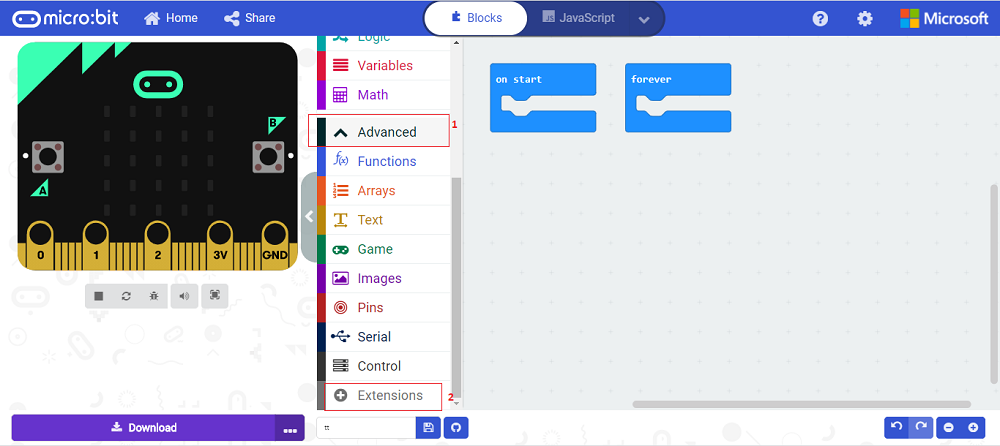
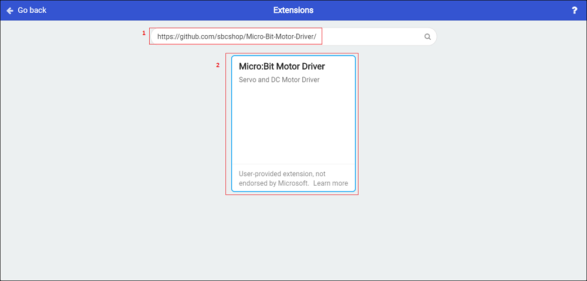
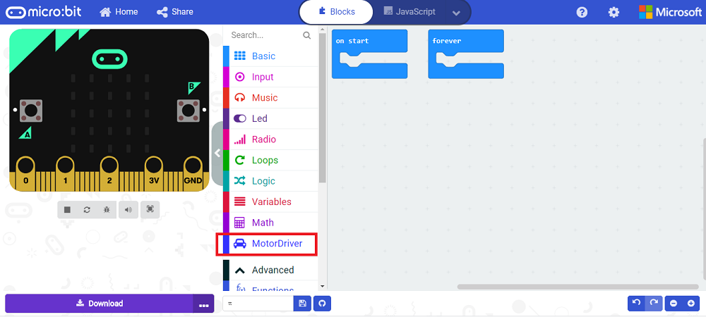

# Unofficial Micro:bit extension for Keyestudio Micro Bit DRV8833 Motor Driver Expansion Board KS4033

A motor driver module designed for the BBC micro:bit.
This module can drive 2 DC motors.

## Official pages of KS4033

* keyestudio / [Keyestudio Micro bit DRV8833 Motor Driver Expansion Board KS4033](https://www.keyestudio.com/products/keyestudio-micro-bit-drv8833-motor-driver-expansion-board)
* keyestudio / wiki / [KS4033](https://wiki.keyestudio.com/KS4033_Keyestudio_Micro_bit_DRV8833_Motor_Driver_Expansion_Board_(Black_and_Eco-friendly))

## Features

* Driveing Two DC motors.
* Integrates 3.3V and 5V voltage regulator chips.
* Serial communication interface for connecting BT modules and a DRV8833CPWP chip
* Outputs the maximum 700mA currentIt
* Four motor control modes: clockwise rotation/anticlockwise rotation/boot/stop.
* PWM supports frequencies up to 100 kHz.
* 3-pin interfaces which can be connected to other sensors.
* The motor pin A1, A2, B2 and B1 of the expansion board are controlled by P13, P12, P15 and P16 of the micro:bit board.

## Specification

* VM input voltage: DC 5-10.8V
  * Remarks: It directry outputs to morters.
* Operating current of driving part: ≤700mA
* Motor output configuration: double h-bridge
* Working temperature: 0-50
* Size: 70mm x 58mm
* Driver: DRV8833

## Pinouts and Connectors

| PIN/CON | Description |
| ------- | ----------- |
| VM      | Power (5-10.8V) |
| GND     | Ground |
| A1      | Positive pole of motor A |
| A2      | Negative pole of motor A |
| B1      | Positive pole of motor B |
| B2      | Negative pole of motor B |

## Programming Guide

* First visit https://makecode.microbit.org/  and create new project, enter project name and create on Create button.
* Click on Advanced , then on Extension as shown below

* Now copy and paste this github link (https://github.com/sbcshop/Micro-Bit-Motor-Driver) in search bar and hit enter/search. as shown below.

* Now click on Search Result to add it on current project, You can verify installation of extension by looking for "Motor Driver" extension as shown below.

Now you can use Motor driver extension feature to run/stop your motors.

### Video Tutorial

      
    

### Based Repository

This project is based on following project:

* Micro:bit extension for sbcshop Motor Driver for micro:bit
  * https://github.com/sbcshop/Micro-Bit-Motor-Driver
